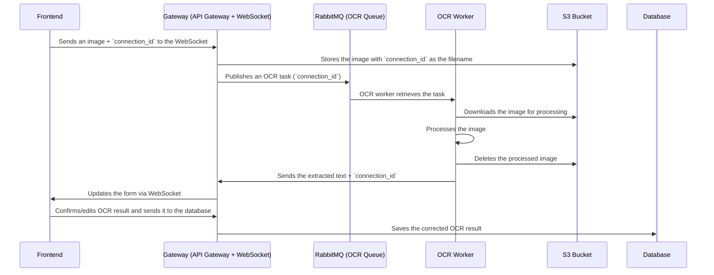

# ADR: Design and Workflow for OCR Task Processing in Microservice Architecture

## Context

In this microservices ecosystem, we need to process OCR tasks from images uploaded by users. The images are uploaded via a frontend that sends them to an API Gateway. The OCR process involves the following components:

- A WebSocket-based communication for real-time updates between the frontend and the backend.
- A RabbitMQ queue that handles OCR tasks.
- An OCR worker that processes the images using OCR technology.
- AWS S3 or a compatible local solution (like MinIO) for image storage.
- A database to store the processed results and any user edits.

This architecture requires efficient and reliable communication between these components to ensure the correct handling of images and data, as well as a robust flow for processing, confirming, and saving OCR results.

## Decision

The decision is to adopt the following workflow for OCR task processing:

1. Frontend sends an image and connection_id via WebSocket to the API Gateway.
2. API Gateway stores the image in an S3 Bucket with the connection_id as the filename.
3. API Gateway then publishes an OCR task to a RabbitMQ Queue, passing the connection_id as part of the task.
4. OCR Worker retrieves the task from RabbitMQ, downloads the image from S3, and processes it.
5. OCR Worker deletes the processed image from S3.
6. OCR Worker sends the extracted text back to the API Gateway with the connection_id.
7. API Gateway updates the frontend via WebSocket with the OCR result.
8. The Frontend confirms or edits the result and sends it back to the API Gateway.
9. API Gateway saves the final corrected result in the Database.

## Rationale
### Real-Time Communication

Using WebSocket for communication between the frontend and API Gateway allows for a real-time update of the OCR results. This provides a smooth user experience, particularly for tasks that require immediate feedback or manual corrections.

### Task Queue for Decoupling

The RabbitMQ message queue is used to decouple the OCR worker from the API Gateway. This allows the OCR worker to process tasks asynchronously, preventing blocking of the main application flow. It also enables scaling of OCR workers independently of the other components.

### Efficient Image Storage and Cleanup

Storing the images in an S3 Bucket allows for efficient and secure image management. After processing, images are deleted to save storage and reduce clutter. This ensures that only relevant data is retained for further processing.

### Simplified Data Flow

The flow of data is streamlined by having a single connection_id serve as a key across multiple components. This reduces the complexity of managing different identifiers across systems, making debugging and tracking easier.

### Flexibility in Storage

By adopting an S3-compatible solution (such as MinIO locally for development and AWS S3 in production), we ensure that the storage solution is consistent and flexible, providing both local and cloud-based storage options.

### Future Scalability

The architecture supports scalability by allowing multiple OCR workers to process tasks concurrently via RabbitMQ. Additionally, the use of a message queue ensures the system can handle spikes in traffic without overloading any single component.

## Consequences
### Positive Outcomes

Separation of Concerns: The decoupling of components (frontend, API gateway, OCR worker, etc.) allows each part of the system to scale independently and be maintained separately.
Real-Time User Feedback: Using WebSockets provides real-time updates, making the user experience smoother.
Scalability: The system can easily scale by adding more OCR workers as needed.
Flexible Storage Options: The ability to switch between AWS S3 and MinIO for local development ensures that the architecture is adaptable to different environments.

### Challenges & Mitigation

Storage Inconsistencies: The use of local MinIO for development may introduce inconsistencies with AWS S3 in production. This can be mitigated through thorough integration testing to ensure parity between environments.
OCR Accuracy: OCR accuracy may vary based on image quality and processing capacity. Continuous testing and potentially using multiple OCR engines can mitigate this.
Message Queue Overload: If the queue becomes overloaded, it could lead to delays in processing. This can be mitigated by implementing rate limiting or back-pressure handling in the RabbitMQ consumer logic.

## Status

Accepted – This workflow design is selected to handle OCR tasks in a scalable and decoupled manner, with real-time feedback for the user and the ability to scale as needed. This architecture will be implemented and monitored for performance, scalability, and robustness.
